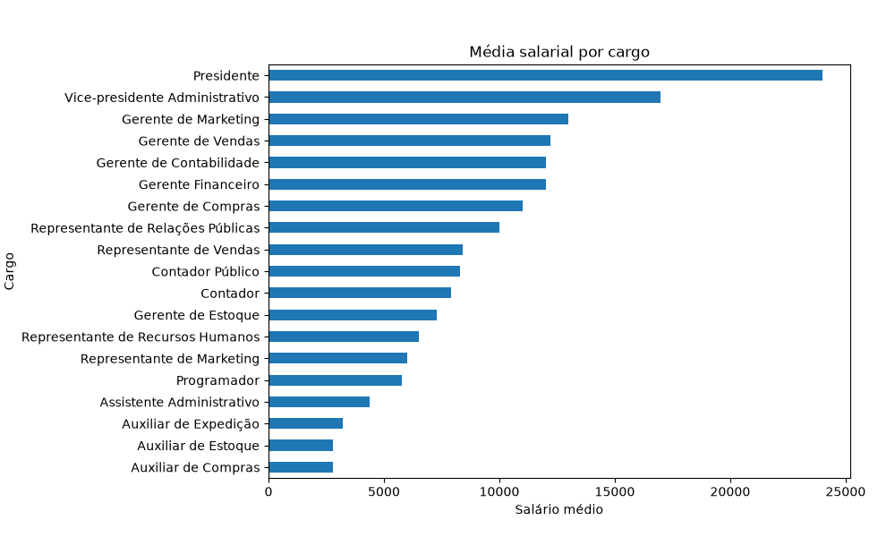
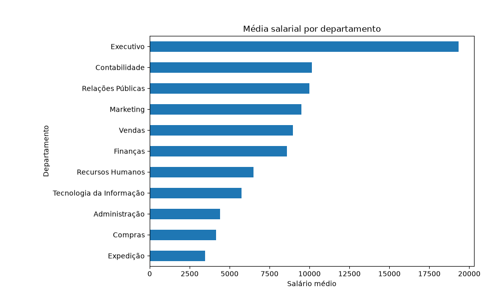
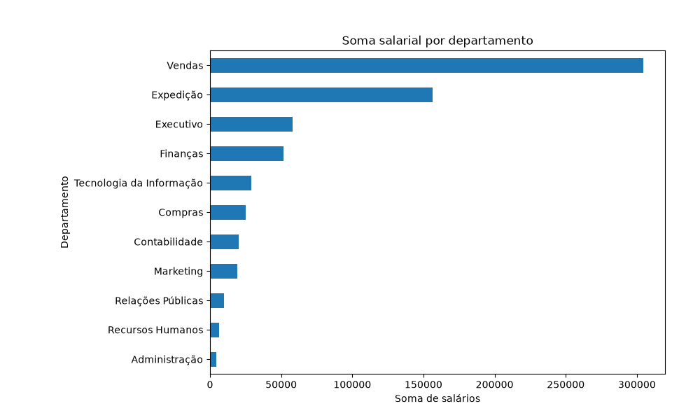
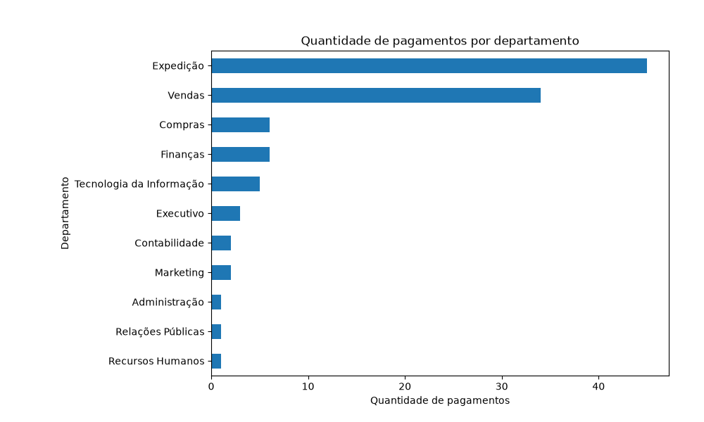
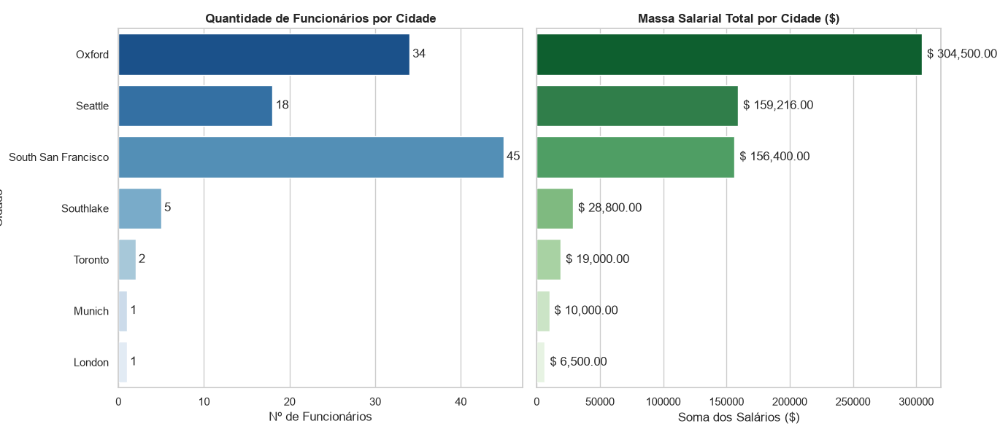
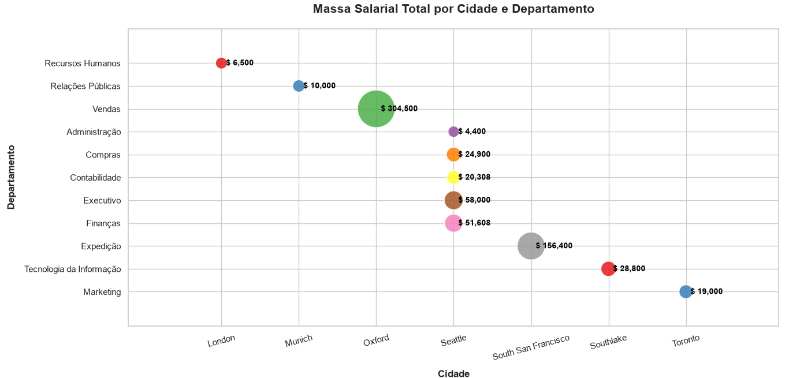

# Projeto M1 HR - Visualização de Dados e Business Intelligence

**Aluno:** Gilberto Barreto  
**Turma:** Visualização-Dados-BI-T3

---

## 🎯 Objetivo do projeto

Este projeto tem como objetivo analisar dados de Recursos Humanos da base HR, utilizando SQL e Python, com foco na distribuição dos salários por departamento e cargo e na distribuição geográfica dos funcionários.

A análise foi desenvolvida a partir dos dados disponíveis no banco FreeSQL, utilizando as tabelas do esquema Human Resources (HR), com aplicação de consultas SQL, análise exploratória de dados, cálculos estatísticos e visualizações gráficas.

---

## 🗄️ Banco de dados

Foi utilizado o banco de dados **FreeSQL**, no esquema **HR (Human Resources)**.

As tabelas utilizadas no projeto foram:

| Tabela | Descrição |
|---|---|
| `EMPLOYEES` | Dados dos funcionários e seus salários |
| `DEPARTMENTS` | Informações dos departamentos |
| `JOBS` | Informações dos cargos |
| `LOCATIONS` | Informações das localidades |
| `COUNTRIES` | Informações dos países |
| `REGIONS` | Informações das regiões |

---

# 🔎 Consultas SQL

Foram desenvolvidas duas consultas SQL para extrair os dados necessários para a análise.

### Query 1 — Salário por Departamento e Cargo

#### Objetivo

Analisar a distribuição de salários por departamento e cargo.

#### Tabelas utilizadas

- `HR.EMPLOYEES`
- `HR.DEPARTMENTS`
- `HR.JOBS`

#### Relacionamentos

A consulta utiliza dois `LEFT JOIN`:

```text
EMPLOYEES → DEPARTMENTS
EMPLOYEES → JOBS
```

O relacionamento entre as tabelas foi realizado pelos campos `DEPARTMENT_ID` e `JOB_ID`.

**Filtro utilizado:** `WHERE DEPARTMENT_NAME IS NOT NULL`

O filtro garante que sejam considerados apenas os registros que possuem um departamento associado.

#### Informações extraídas

A consulta retorna:

- Identificação do funcionário
- Salário
- Departamento
- Cargo

O resultado foi exportado para `query_01.csv`.

### Query 2 — Funcionários por Região

#### Objetivo

Analisar a distribuição dos funcionários e dos salários considerando informações de localização, como cidade, estado, país e região.

#### Tabelas utilizadas

- `HR.EMPLOYEES`
- `HR.DEPARTMENTS`
- `HR.LOCATIONS`
- `HR.COUNTRIES`
- `HR.REGIONS`

#### Relacionamentos

A consulta utiliza quatro LEFT JOIN, formando a seguinte relação:

```text
EMPLOYEES
    ↓
DEPARTMENTS
    ↓
LOCATIONS
    ↓
COUNTRIES
    ↓
REGIONS
```

#### Filtro utilizado
`WHERE REGION_NAME IS NOT NULL`

O filtro garante que sejam considerados apenas os registros associados a uma região.

#### Informações extraídas

A consulta retorna:

- Identificação do funcionário
- Salário
- Departamento
- Cidade
- Estado
- País
- Região

O resultado foi exportado para `query_02.csv`.

## Análise feita em Python

Após a extração dos dados das consultas SQL, os arquivos CSV foram importados para o Python para realização da Análise Exploratória de Dados (EDA), cálculos estatísticos e geração das visualizações.

Foram utilizadas bibliotecas para manipulação, análise e visualização dos dados.

A análise foi realizada no VS Code, utilizando Python resultando no arquivo analise.py.

### 📊 Query 1 — Análise dos salários

A Query 1 possui 106 registros, distribuídos entre 11 departamentos e 19 cargos.

Durante a análise exploratória foram verificadas as características gerais dos dados, incluindo:

- Quantidade de registros
- Quantidade de departamentos
- Quantidade de cargos
- Valores nulos
- Registros duplicados
- Distribuição dos salários

Não foram identificados valores nulos ou registros duplicados nos dados utilizados na análise.

#### Estatísticas dos salários
| Medida | Valor |
|---|---:|
| Quantidade de registros | 106 |
| Média salarial | $ 6.456,75 |
| Mediana | $ 6.150,00 |
| Mínimo | $ 2.100,00 |
| Máximo | $ 24.000,00 |
| Desvio padrão | $ 3.927,80 |

A média salarial de 6.456,75 ficou acima da mediana de 6.150,00. Essa diferença indica que os salários mais elevados exercem influência sobre a média da distribuição.

Os salários apresentam uma amplitude significativa, variando de $ 2.100,00 a $ 24.000,00.

### 📈 Visualizações da Query 1

Foram utilizadas visualizações para analisar os salários sob diferentes perspectivas.

### Média salarial por cargo



O gráfico permite comparar a média salarial entre os diferentes cargos.

Entre os cargos analisados, o maior salário médio corresponde ao cargo de Presidente, com $ 24.000,00.

Entre os menores valores estão cargos auxiliares, como:

Auxiliar de Compras (2780.00);
Auxiliar de Estoque (2785.00);
Auxiliar de Expedição (3215.00).

Os resultados mostram uma diferença significativa entre os níveis de remuneração dos diferentes cargos.

### Média salarial por departamento



A análise por departamento mostrou diferenças entre as médias salariais.

O departamento Executivo ( 19333.33) apresentou a maior média salarial, enquanto Expedição (3475.56) apresentou a menor média entre os departamentos analisados.

### Soma salarial por departamento



A soma dos salários permite observar a concentração da massa salarial entre os departamentos.

O departamento de Vendas apresentou uma soma salarial de aproximadamente $ 304,500.00, destacando-se pelo volume total de salários. Enquanto que o depatartamento de Administração apresentou uma soma salarial de $ 4,400.00

Esse resultado demonstra que o departamento com maior massa salarial não necessariamente é o departamento com maior média salarial.

### Quantidade de pagamentos por departamento

| Departamento | Qtd. de Pagamentos |
| --- | --- |
| Expedição | 45 |
| Vendas | 34 |
| Compras | 6 |
| Finanças | 6 |
| Tecnologia da Informação | 5 |
| Executivo | 3 |
| Contabilidade | 2 |
| Marketing | 2 |
| Administração | 1 |
| Relações Públicas | 1 |
| Recursos Humanos | 1 |



A quantidade de pagamentos foi utilizada para complementar a análise da distribuição salarial entre os departamentos.

Essa medida permite observar a quantidade de registros salariais associados a cada departamento e, juntamente com a média e a soma dos salários, ajuda a compreender a composição dos valores encontrados.

### 🌎 Query 2 — Análise geográfica

A segunda consulta foi utilizada para analisar a distribuição dos funcionários e dos salários de acordo com sua localização.

A análise considerou informações de cidade, estado, país, região, departamento e salário.

Foram identificadas 7 cidades, 4 países e 2 regiões nos dados analisados.

Durante a análise exploratória foi identificado um valor ausente no campo de estado associado à cidade de London. Para melhorar a identificação geográfica dos dados, esse valor foi tratado como Greater London.

### Quantidade de funcionários e total de salários por cidade



### Total de salários por cidade e departamento



Entre os resultados encontrados:

South San Francisco apresentou a maior quantidade de funcionários, com 45 registros;
Oxford apresentou 34 registros;
Seattle apresentou 18 registros.

A análise também mostrou diferenças entre a quantidade de funcionários e a soma dos salários em cada localidade.

Oxford, por exemplo, apresentou uma soma salarial de aproximadamente $ 304.500,00, enquanto South San Francisco concentrou a maior quantidade de funcionários.

Esse resultado demonstra que a quantidade de funcionários de uma localidade não determina necessariamente que ela terá a maior soma salarial.

## 💡 Principais insights

A análise das duas consultas permitiu identificar alguns pontos relevantes:

1. Diferença entre média e mediana salarial

A média salarial foi de $ 6.456,75, enquanto a mediana foi de $ 6.150,00.

A média superior à mediana indica influência dos salários mais elevados sobre o valor médio.

2. Diferença salarial entre cargos

Os cargos apresentam diferenças expressivas de remuneração média.

O cargo de Presidente apresentou média salarial de $ 24.000,00, enquanto cargos auxiliares apresentaram valores significativamente menores.

3. Diferença salarial entre departamentos

Os departamentos também apresentam diferenças nas médias salariais.

O departamento Executivo apresentou a maior média, enquanto Expedição apresentou a menor média entre os departamentos analisados.

4. Média salarial e massa salarial são medidas diferentes

A análise da soma dos salários mostrou que o departamento com maior massa salarial não necessariamente possui a maior média salarial.

Vendas apresentou soma salarial de aproximadamente $ 304.500,00, enquanto o departamento Executivo apresentou a maior média salarial.

5. Quantidade de funcionários e massa salarial também podem apresentar comportamentos diferentes

Na análise geográfica, South San Francisco apresentou a maior quantidade de funcionários, enquanto Oxford apresentou a maior soma salarial entre as localidades analisadas.

Isso mostra a importância de observar simultaneamente quantidade de registros, média salarial e soma dos salários.

## ⚠️ Limitações da análise

Os resultados devem ser interpretados considerando que a análise foi realizada sobre os dados disponíveis na base HR utilizada no projeto.

As consultas utilizam filtros para excluir registros sem departamento ou sem região. Dessa forma, os resultados representam os registros que atenderam às condições definidas nas consultas.

Além disso, a análise apresenta um retrato dos dados disponíveis na base e não considera outros fatores que poderiam influenciar salários, como tempo de empresa, experiência profissional, desempenho, benefícios ou outros componentes da remuneração.

## ▶️ Como executar o projeto
### Pré-requisitos

Para executar o projeto é necessário ter instalado:

Python;
Visual Studio Code;
Git;
acesso aos arquivos CSV gerados pelas consultas.

### Bibliotecas utilizadas

As principais bibliotecas utilizadas na análise são:

pandas
numpy
matplotlib
seaborn

### Instalação
Primeiro precisa criar uma pasta/diretório no VS Code, onde estarão os arquivos.
baixe do github os seguintes arquivos e coloque no diretório:

- query_1.csv
- query_2.csv
- analise.py
- requirements.txt

No terminal do VS Code crie o ambiente virtual:

python -m venv .venv

Ative o ambiente virtual no Windows:

.venv\Scripts\Activate.ps1

#### Instalação de bibliotecas

Com a estrutura formada podemos fazer as instalações

Opção 1: Instalação das bibliotecas: (copie o comando abaixo e cole no terminal do VS Code)
    python -m pip install pandas matplotlib seaborn
Versões utilizadas:
    pandas      3.0.6
    numpy       2.5.3
    matplotlib  3.11.2
    seaborn     0.13.2

Opção 2: rodar o arquivo requirements.txt (copie o comando abaixo e cole no terminal do VS Code)
    python -m pip install -r requirements.txt

OBS: o arquivo requirements.txt deve estar no diretório do projeto, para a instalação funcionar corretamente. 
O arquivo está disponível no repositório do projeto (github).

### Execução

No terminal execute o arquivo Python:

python analise.py

O código realiza a leitura dos arquivos CSV, a análise exploratória, os cálculos estatísticos e a geração dos gráficos.

## 🌿 Versionamento

O projeto foi desenvolvido utilizando Git e GitHub, com branches separadas para as principais etapas do desenvolvimento.

Branches utilizadas:

main
feat/sql
feat/dados
feat/analise
feat/graficos
docs

Foram usadas várias branches para fins didáticos.

Os gráficos gerados durante a análise podem ser encontrados no repositório e utilizados para complementar a interpretação dos resultados.

### Principais visualizações

Média salarial por cargo;
Média salarial por departamento;
Soma dos salários por departamento;
Quantidade de pagamentos por departamento;
Visualização da distribuição dos salários por região.

## 🔮 Sugestões de melhorias

Como possíveis melhorias para futuras versões do projeto, podem ser consideradas:

inclusão de novos indicadores de RH;
análise da evolução salarial ao longo do tempo;
inclusão de informações de tempo de empresa;
análise mais detalhada das diferenças salariais entre cargos e departamentos;
utilização de outras ferramentas de Business Intelligence para apresentação dos resultados.
